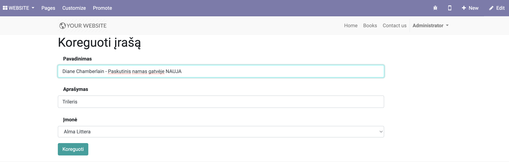

# Odoo namų darbas
## Pagrindinė užduotis

Namų ekranas 

Paspaudus Website > Books atsidaro įrašų sąrašas 

Namų puslapyje paspaudus "+Pridėti naują įrašą" galima sukurti naują įrašą 
(Įmonės laukelis turi Many2one ryšį su res.company modeliu)

Paspaudus "edit" ikoną galima koreguoti įrašą 

Paspaudus šiukšliadėžės ikoną galima ištrinti įrašą 

## Bonus užduotis

Užduotis: "Sukurti wizard tipo formą, kuri turėtų datos nuo ir datos iki laukelius, ir pagal juos atspausdintų
visų dokumentų sąrašą pagal datą."
 
 
Paspaudus Website > Filtruoti pagal datą įrašai išfiltruojami pagal pasirinktas datas 

